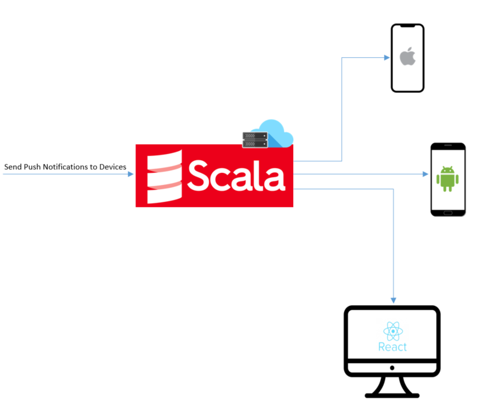

# ScalaP
## Description
Service of push notification written in Scala.

### For What?

ScalaP can send push notifications to multiple devices on different platforms, such as, Android, iOS or Web..
 

### Tech stack

Primary:
* Scala
* Java 
* gRPC

Also:
* Android
* Swift (iOS)
* React JS
